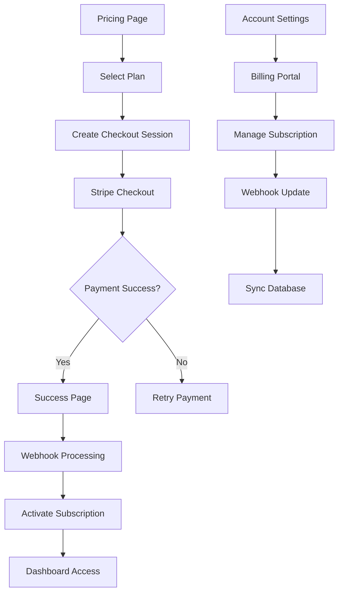

## 1. Product Overview

A comprehensive payment integration system for Next.js applications that enables secure subscription management, one-time payments, and customer self-service through Stripe. The system provides seamless payment experiences with automated webhook processing and subscription lifecycle management.

This solution helps businesses accept payments online, manage recurring subscriptions, and provide customers with self-service billing management capabilities while maintaining PCI compliance and security best practices.

## 2. Core Features

### 2.1 User Roles

| Role | Registration Method | Core Permissions |
|------|---------------------|------------------|
| Customer | Email registration with Stripe Checkout | View pricing, make payments, manage subscriptions, access billing history |
| Admin | Manual setup or admin registration | Configure pricing plans, view all transactions, manage webhooks, access analytics |

### 2.2 Feature Module

Our payment integration system consists of the following main pages:

1. **Pricing Page**: Subscription tiers, feature comparison, plan selection
2. **Checkout Page**: Secure payment processing, form validation, payment methods
3. **Success Page**: Payment confirmation, subscription details, next steps
4. **Billing Portal**: Subscription management, payment history, invoice downloads
5. **Account Settings**: Payment methods, billing information, subscription status

### 2.3 Page Details

| Page Name | Module Name | Feature description |
|-----------|-------------|---------------------|
| Pricing Page | Plan Selection | Display subscription tiers with features and pricing. Allow users to select monthly/yearly billing cycles. Show recommended plan badges. |
| Pricing Page | Feature Comparison | Compare plan features in responsive table format. Highlight differences between tiers. Include tooltips for feature explanations. |
| Checkout Page | Payment Form | Secure credit card input with real-time validation. Support for multiple payment methods (card, Apple Pay, Google Pay). Auto-fill billing address. |
| Checkout Page | Order Summary | Display selected plan, billing cycle, total amount. Show applicable taxes and discounts. Include terms acceptance checkbox. |
| Success Page | Confirmation | Display payment success message with checkmark animation. Show subscription details and next billing date. Provide access to customer portal. |
| Success Page | Quick Actions | Offer immediate access to dashboard or account settings. Include email confirmation notice. |
| Billing Portal | Subscription Status | Show current plan, status, and renewal date. Display payment method on file. Include upgrade/downgrade options. |
| Billing Portal | Payment History | List all past payments with dates and amounts. Allow invoice downloads in PDF format. Show refund status if applicable. |
| Account Settings | Payment Methods | Add, edit, or remove payment methods. Set default payment method. Show billing address management. |
| Account Settings | Subscription Management | Cancel, pause, or modify subscriptions. Handle proration calculations. Show downgrade restrictions. |

## 3. Core Process

### Customer Payment Flow
1. User browses pricing plans and selects desired subscription tier
2. System creates Stripe Checkout session with selected plan details
3. User completes secure payment on Stripe-hosted checkout page
4. Stripe redirects user to success page with session ID
5. Webhook processes payment confirmation and activates subscription
6. User gains immediate access to subscribed features

### Subscription Management Flow
1. Authenticated user accesses billing portal from account settings
2. System creates Stripe Customer Portal session
3. User manages subscription through Stripe-hosted interface
4. Webhooks receive and process subscription changes
5. Local database updates to reflect new subscription status
6. User permissions update automatically based on new plan

### Webhook Processing Flow
1. Stripe sends webhook event to configured endpoint
2. System validates webhook signature for security
3. Event type determines processing logic (payment, subscription, invoice)
4. Database updates user subscription state and payment records
5. System sends confirmation emails for critical events
6. Failed webhooks retry with exponential backoff

## 4. User Interface Design

### 4.1 Design Style
- **Primary Colors**: Stripe blue (#0066FF) for CTAs, success green (#10B981) for confirmations
- **Secondary Colors**: Neutral grays for backgrounds, warning orange for alerts
- **Button Style**: Rounded corners (8px radius), subtle shadows on hover
- **Font**: Inter for headings, system-ui for body text (14-16px base)
- **Layout**: Card-based design with consistent spacing (8px grid system)
- **Icons**: Heroicons for consistency, Stripe brand elements where applicable

### 4.2 Page Design Overview

| Page Name | Module Name | UI Elements |
|-----------|-------------|-------------|
| Pricing Page | Plan Cards | Responsive grid layout with 3 pricing tiers. Cards have subtle borders and hover effects. Popular plan highlighted with badge. |
| Pricing Page | CTAs | Prominent "Get Started" buttons with loading states. Monthly/Yearly toggle switch. |
| Checkout Page | Payment Form | Clean white background with card element styling. Progress indicator showing checkout steps. |
| Checkout Page | Security Badges | SSL certificate badges and PCI compliance indicators. Trust badges near payment form. |
| Success Page | Confirmation | Large green checkmark icon with success message. Subscription details in readable format. |
| Billing Portal | Status Card | Subscription status with color-coded badges (active, canceled, past due). |
| Account Settings | Payment Methods | List of saved cards with last 4 digits and brand icons. Add payment method button. |

### 4.3 Responsiveness
Desktop-first design approach with mobile optimization. Payment forms adapt to single-column layout on mobile. Touch-friendly button sizes (minimum 44px height). Optimized for mobile wallets and one-click payments.

## 5. Security & Compliance

### 5.1 PCI Compliance
- No credit card data stored locally - all handled by Stripe
- HTTPS enforcement for all payment pages
- Secure webhook signature validation
- Regular security audits and penetration testing

### 5.2 Data Protection
- Encrypted database storage for subscription metadata
- GDPR compliance for user data handling
- Secure API key management with environment variables
- Audit logging for all payment-related activities