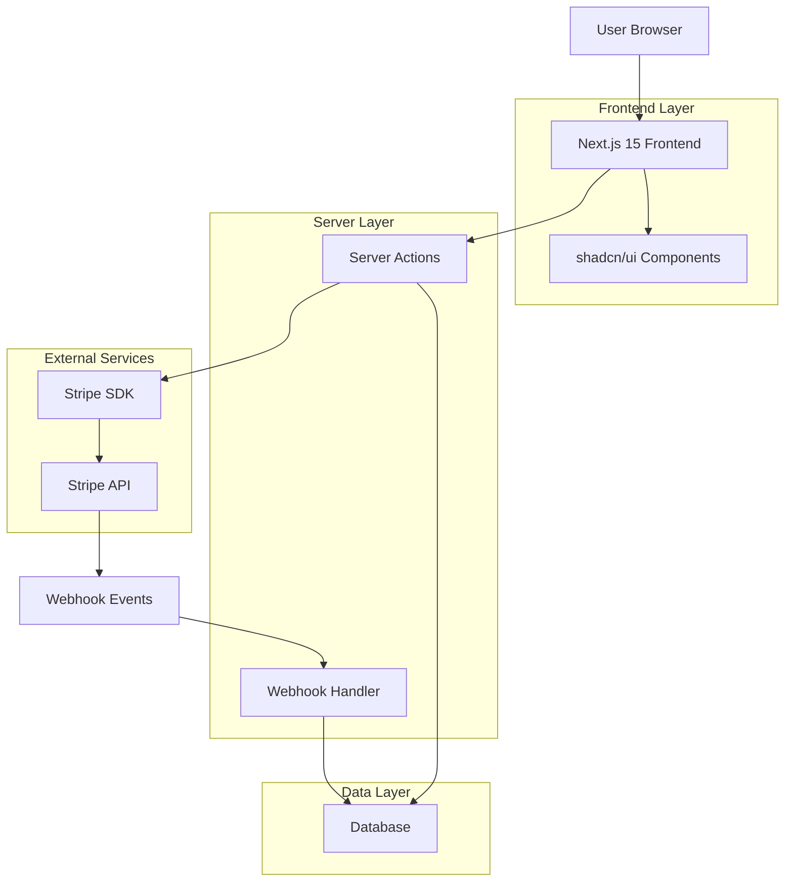
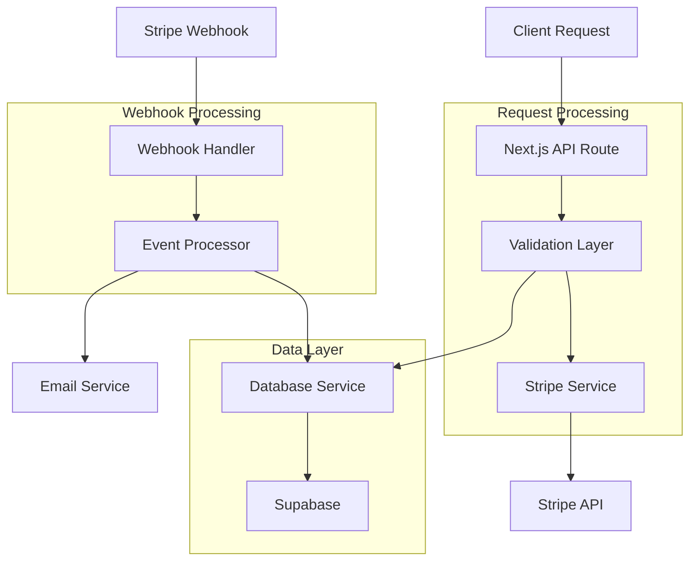
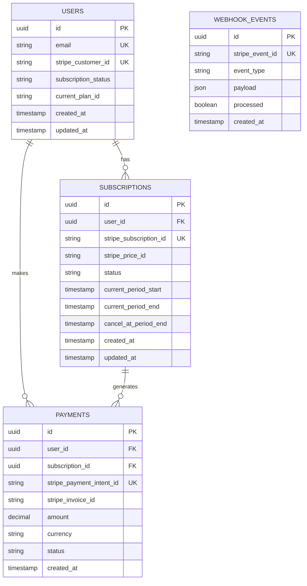

## 1. Architecture Design



## 2. Technology Description

- **Frontend**: Next.js 15 + React 18 + TypeScript + shadcn/ui + Tailwind CSS
- **Initialization Tool**: create-next-app@latest
- **Backend**: Next.js 15 Server Actions + Route Handlers
- **Database**: Supabase (PostgreSQL)
- **Payment Processing**: Stripe SDK with latest API version
- **UI Components**: shadcn/ui with Radix UI primitives

## 3. Route Definitions

| Route | Purpose |
|-------|---------|
| `/pricing` | Display subscription plans and pricing tiers |
| `/checkout` | Secure payment form with Stripe Elements |
| `/checkout/success` | Payment confirmation and subscription activation |
| `/checkout/cancel` | Payment cancellation and retry options |
| `/account/billing` | Subscription management and billing history |
| `/api/webhooks/stripe` | Webhook endpoint for Stripe events |
| `/api/create-checkout-session` | Server action for checkout session creation |
| `/api/create-portal-session` | Server action for customer portal creation |

## 4. API Definitions

### 4.1 Checkout Session Creation

```
POST /api/create-checkout-session
```

Request:
| Param Name | Param Type | isRequired | Description |
|------------|------------|-------------|-------------|
| priceId | string | true | Stripe Price ID for selected plan |
| successUrl | string | true | Redirect URL after successful payment |
| cancelUrl | string | true | Redirect URL if payment cancelled |
| customerEmail | string | false | Pre-fill customer email |
| metadata | object | false | Additional session metadata |

Response:
| Param Name | Param Type | Description |
|------------|-------------|-------------|
| sessionId | string | Stripe Checkout Session ID |
| url | string | Redirect URL for Checkout |
| status | string | Response status |

Example:
```json
{
  "priceId": "price_1234567890",
  "successUrl": "http://localhost:3000/checkout/success?session_id={CHECKOUT_SESSION_ID}",
  "cancelUrl": "http://localhost:3000/checkout/cancel",
  "customerEmail": "user@example.com",
  "metadata": {
    "userId": "user_123"
  }
}
```

### 4.2 Portal Session Creation

```
POST /api/create-portal-session
```

Request:
| Param Name | Param Type | isRequired | Description |
|------------|------------|-------------|-------------|
| customerId | string | true | Stripe Customer ID |
| returnUrl | string | true | Return URL after portal session |

Response:
| Param Name | Param Type | Description |
|------------|-------------|-------------|
| url | string | Customer Portal URL |
| status | string | Response status |

## 5. Server Architecture Diagram



## 6. Data Model

### 6.1 Database Schema



### 6.2 Data Definition Language

```sql
-- Users table
CREATE TABLE users (
    id UUID PRIMARY KEY DEFAULT gen_random_uuid(),
    email VARCHAR(255) UNIQUE NOT NULL,
    stripe_customer_id VARCHAR(255) UNIQUE,
    subscription_status VARCHAR(50) DEFAULT 'inactive',
    current_plan_id VARCHAR(255),
    created_at TIMESTAMP WITH TIME ZONE DEFAULT NOW(),
    updated_at TIMESTAMP WITH TIME ZONE DEFAULT NOW()
);

-- Subscriptions table
CREATE TABLE subscriptions (
    id UUID PRIMARY KEY DEFAULT gen_random_uuid(),
    user_id UUID NOT NULL REFERENCES users(id) ON DELETE CASCADE,
    stripe_subscription_id VARCHAR(255) UNIQUE NOT NULL,
    stripe_price_id VARCHAR(255) NOT NULL,
    status VARCHAR(50) NOT NULL,
    current_period_start TIMESTAMP WITH TIME ZONE,
    current_period_end TIMESTAMP WITH TIME ZONE,
    cancel_at_period_end BOOLEAN DEFAULT FALSE,
    created_at TIMESTAMP WITH TIME ZONE DEFAULT NOW(),
    updated_at TIMESTAMP WITH TIME ZONE DEFAULT NOW()
);

-- Payments table
CREATE TABLE payments (
    id UUID PRIMARY KEY DEFAULT gen_random_uuid(),
    user_id UUID NOT NULL REFERENCES users(id) ON DELETE CASCADE,
    subscription_id UUID REFERENCES subscriptions(id) ON DELETE SET NULL,
    stripe_payment_intent_id VARCHAR(255) UNIQUE,
    stripe_invoice_id VARCHAR(255),
    amount DECIMAL(10, 2) NOT NULL,
    currency VARCHAR(3) NOT NULL DEFAULT 'usd',
    status VARCHAR(50) NOT NULL,
    created_at TIMESTAMP WITH TIME ZONE DEFAULT NOW()
);

-- Webhook events table
CREATE TABLE webhook_events (
    id UUID PRIMARY KEY DEFAULT gen_random_uuid(),
    stripe_event_id VARCHAR(255) UNIQUE NOT NULL,
    event_type VARCHAR(100) NOT NULL,
    payload JSONB NOT NULL,
    processed BOOLEAN DEFAULT FALSE,
    created_at TIMESTAMP WITH TIME ZONE DEFAULT NOW()
);

-- Indexes for performance
CREATE INDEX idx_users_email ON users(email);
CREATE INDEX idx_users_stripe_customer ON users(stripe_customer_id);
CREATE INDEX idx_subscriptions_user_id ON subscriptions(user_id);
CREATE INDEX idx_subscriptions_status ON subscriptions(status);
CREATE INDEX idx_payments_user_id ON payments(user_id);
CREATE INDEX idx_webhook_events_stripe_event ON webhook_events(stripe_event_id);
CREATE INDEX idx_webhook_events_processed ON webhook_events(processed);

-- Row Level Security (RLS) policies
ALTER TABLE users ENABLE ROW LEVEL SECURITY;
ALTER TABLE subscriptions ENABLE ROW LEVEL SECURITY;
ALTER TABLE payments ENABLE ROW LEVEL SECURITY;

-- Grant permissions
GRANT SELECT ON users TO anon;
GRANT SELECT ON subscriptions TO anon;
GRANT SELECT ON payments TO anon;
GRANT ALL ON users TO authenticated;
GRANT ALL ON subscriptions TO authenticated;
GRANT ALL ON payments TO authenticated;

-- RLS Policies
CREATE POLICY "Users can view own data" ON users FOR SELECT USING (auth.uid() = id);
CREATE POLICY "Users can update own data" ON users FOR UPDATE USING (auth.uid() = id);
CREATE POLICY "Users can view own subscriptions" ON subscriptions FOR SELECT USING (auth.uid() = user_id);
CREATE POLICY "Users can view own payments" ON payments FOR SELECT USING (auth.uid() = user_id);
```

## 7. Environment Variables

```bash
# Stripe Configuration
NEXT_PUBLIC_STRIPE_PUBLISHABLE_KEY=pk_test_...
STRIPE_SECRET_KEY=sk_test_...
STRIPE_WEBHOOK_SECRET=whsec_...

# Database
NEXT_PUBLIC_SUPABASE_URL=https://your-project.supabase.co
NEXT_PUBLIC_SUPABASE_ANON_KEY=your-anon-key
SUPABASE_SERVICE_ROLE_KEY=your-service-role-key

# Application
NEXT_PUBLIC_APP_URL=http://localhost:3000
NEXT_PUBLIC_STRIPE_PRICE_ID_BASIC=price_...
NEXT_PUBLIC_STRIPE_PRICE_ID_PRO=price_...
NEXT_PUBLIC_STRIPE_PRICE_ID_PREMIUM=price_...
```

## 8. Security Implementation

### 8.1 Webhook Security
```typescript
// Webhook signature validation
const sig = request.headers.get('stripe-signature')!
const event = stripe.webhooks.constructEvent(
  payload,
  sig,
  process.env.STRIPE_WEBHOOK_SECRET!
)
```

### 8.2 Server Actions Security
- Input validation with Zod schemas
- Rate limiting for payment endpoints
- CSRF protection for form submissions
- Server-side amount validation
- Idempotency key handling

### 8.3 Client-Side Security
- Stripe Elements for PCI-compliant card input
- Content Security Policy headers
- HTTPS enforcement
- Secure session management
- XSS protection