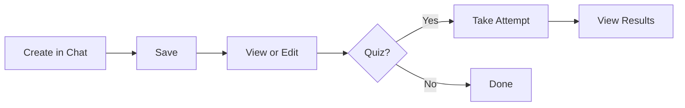

# PRD: Artifacts

## What is it?

Artifacts are saved outputs from chat: quizzes, rubric analyses, and study notes. Users can view, edit, and revisit saved content. Quiz artifacts support taking the quiz and recording attempts.

## Artifact Lifecycle

## Key Requirements

- Save quiz, rubric_analysis, or note from chat
- List user's artifacts
- View and edit artifacts
- Quiz: take quiz, submit answers, see results
- Track quiz attempts (score, time, answers)

## How it is implemented

- **Storage:** `dev.artifacts` — id, user_id, title, description, tags, artifact_type (quiz | rubric_analysis | note), artifact_data (JSONB)
- **Attempts:** `dev.quiz_attempts` — artifact_id, user_answers, score, total_questions, time_taken_seconds
- **API:** `GET/POST /api/artifacts`, `GET/PUT/DELETE /api/artifacts/[id]`, `GET/POST /api/quiz-attempts`
- **UI:** ArtifactPanel, SaveArtifactDialog, ArtifactViewer, ArtifactEditor, ArtifactCard; quiz modal, QuizResultsRadial
- **Routes:** `/protected/artifacts`, `/protected/artifacts/[id]`, `/protected/artifacts/[id]/attempts/[attemptId]`

## Related

- [Quiz Mode PRD](/docs/prd/modes-quiz)
- [Rubric Mode PRD](/docs/prd/modes-rubric)
- [Note Mode PRD](/docs/prd/modes-note)
- [Data Model](/docs/system-design/data-model)
