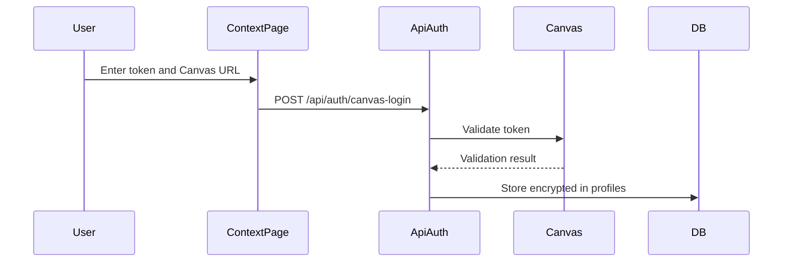

# PRD: Canvas Integration

## What is it?

Canvas Integration lets users connect their Canvas LMS account so Lulu can fetch their courses, modules, assignments, and content. The assistant uses this data to provide study help, generate quizzes, and summarize materials.

## Token Setup Sequence

## Key Requirements

- Users enter Canvas API token and institution URL
- Token stored securely (encrypted)
- AI can call Canvas API via tools (list_courses, get_assignments, get_modules, etc.)
- Works with any Canvas instance (self-hosted or cloud)

## How it is implemented

- **Setup:** Context page (`/protected/context`) — user enters token and Canvas URL; `POST /api/auth/canvas-login` validates and stores
- **Storage:** `dev.profiles` — `canvas_api_key_encrypted`, `canvas_api_url`; encryption via `lib/crypto`
- **API client:** `CanvasAPIService` in `lib/canvas-api.ts` — wraps Canvas REST API
- **Tools:** `createCanvasTools` in `lib/canvas-tools.ts` — exposes list_courses, get_assignments, get_modules, get_module, get_page_content, etc. to the agent
- **Token flow:** Chat route fetches profile, decrypts token, creates tools; tools execute with user's credentials

## Related

- [ADR-002: Canvas Token Storage](/docs/adr/002-canvas-token-storage)
- [Context Management PRD](/docs/prd/context-management)
- [Data Model](/docs/system-design/data-model)
