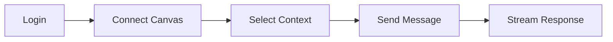

# PRD: Chat

## What is it?

Chat is the core conversational interface of Lulu. Students have real-time AI conversations that are context-aware: the assistant can access their Canvas courses, assignments, and modules to provide relevant help. Responses are streamed for a responsive experience.

## Chat User Flow

For the detailed request/response sequence, see [Chat Flow](/docs/system-design/chat-flow).

## Key Requirements

- Real-time streaming responses
- Session persistence (chat history saved per session)
- Context attachment: users can attach courses, assignments, or modules to messages
- System prompt selection (generic or mode-specific)
- Model selection (via OpenRouter)
- Optional web search (Tavily) for facts outside Canvas
- Tool use: Canvas API, web search when enabled

## How it is implemented

- **Frontend:** `useChat` from Vercel AI SDK on the protected chat page; sends messages to `POST /api/chat` with `model`, `mode`, `selected_context`, `selected_system_prompt_ids`
- **Session:** `X-Session-ID` header identifies session; session created on first message; stored in `dev.chat_sessions`, messages in `dev.chat_messages`
- **API:** `/api/chat` — auth via Supabase, system prompt from DB or mode template, Canvas tools when token available, agent loop with tools
- **Streaming:** `toUIMessageStreamResponse` with `smoothStream` for token-by-token display

## Related

- [ADR-001: OpenRouter](/docs/adr/001-openrouter-vs-direct)
- [ADR-004: AI SDK Agent](/docs/adr/004-ai-sdk-agent)
- [Chat Flow](/docs/system-design/chat-flow)
