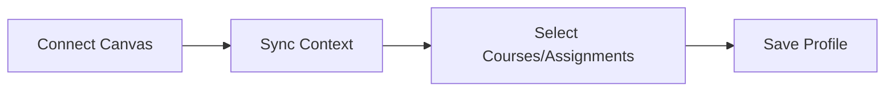

# PRD: Context Management

## What is it?

Context Management lets users select which Canvas courses, assignments, and modules to include in chat. Users can also manage system prompts (custom and templates) and save context profiles for quick switching.

## Context Management Flow

For the full data flow diagram, see [Context Management (System Design)](/docs/system-design/context-management).

## Key Requirements

- Select courses, assignments, modules from available Canvas data
- Persist selection in user_context_selections
- Context profiles: save and load named presets
- System prompts: select from templates or custom prompts
- Canvas token configuration (connect/disconnect)

## How it is implemented

- **Data:** `dev.user_context_selections` (selected_courses, selected_assignments, selected_modules, current_profile_id, current_system_prompt_id, enabled_system_prompt_ids)
- **Profiles:** `dev.context_profiles` — named presets with selection data
- **System prompts:** `dev.system_prompts` — templates (is_template) and user-created
- **UI:** `/protected/context` — Canvas connect, context selector, profile manager, system prompt list
- **Chat integration:** Selected context sent as `selected_context` in chat body; attached as message parts with type 'context'

## Related

- [Context Management (System Design)](/docs/system-design/context-management)
- [Canvas Integration PRD](/docs/prd/canvas-integration)
- [Data Model](/docs/system-design/data-model)
