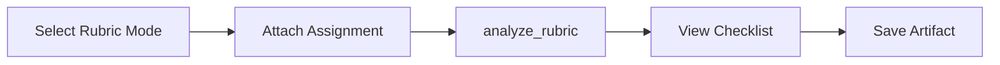

# PRD: Rubric Mode

## What is it?

Rubric Mode helps students understand assignment rubrics. The assistant analyzes rubric criteria, explains what is expected, and can produce a checklist or breakdown. Users attach an assignment (with rubric) to the conversation.

## Rubric Mode Flow

## Key Requirements

- Mode-specific system prompt emphasizing rubric analysis
- Tool restriction: when rubric mode is active and no analysis yet, only `analyze_rubric` is offered initially
- Structured output for checklist/criteria breakdown
- Save as artifact (rubric_analysis type)

## How it is implemented

- **Mode selection:** Chat page mode selector; `mode: 'rubric'` sent in request body
- **System prompt:** Chat route fetches or builds rubric-specific prompt; instructs AI to call `analyze_rubric` for attached assignments
- **Tool:** `analyze_rubric` in canvas-tools — fetches assignment and rubric from Canvas, returns structured data
- **Restriction:** Chat route conditionally restricts tools until `analyze_rubric` has been called
- **Artifact:** Rubric analysis can be saved via SaveArtifactDialog with `artifact_type: 'rubric_analysis'`

## Related

- [Modes (System Design)](/docs/system-design/modes)
- [Artifacts PRD](/docs/prd/artifacts)
- [Canvas Integration PRD](/docs/prd/canvas-integration)
