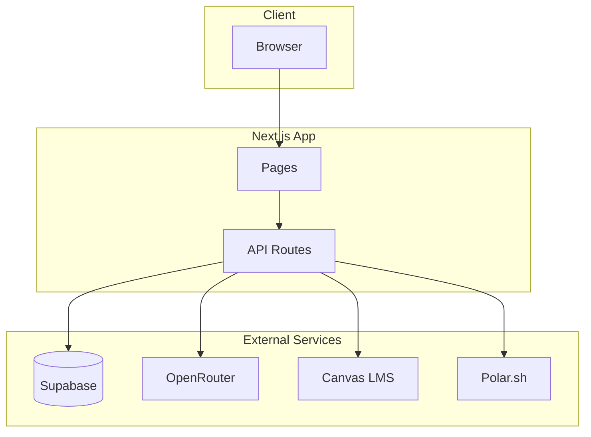

# Architecture

This page describes the high-level architecture of Lulu.

## High-Level Diagram

## Request Flow

1. **User** interacts with the chat or study tools in the browser
2. **Next.js** handles routing and server components
3. **API routes** process requests, authenticate, and coordinate with external services
4. **Supabase** stores user data, chat history, and embeddings
5. **OpenRouter** powers AI-generated responses and study content
6. **Canvas** provides course context via OAuth
7. **Polar** manages subscriptions and billing

## Deployment

The application is designed to run on Vercel with serverless functions for API routes.
