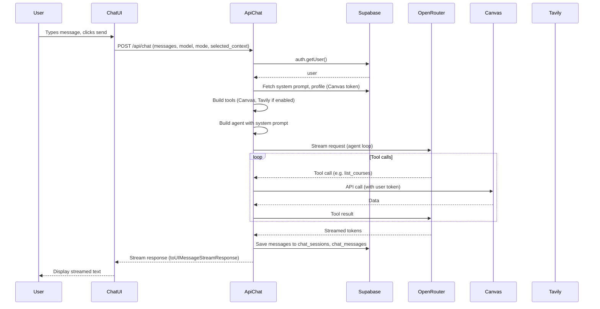

# Chat Flow

This page describes the end-to-end flow of a chat message from the browser to the AI response.

## Request Flow Diagram

## Key Steps

1. **Client:** `useChat` sends `POST /api/chat` with messages, model, mode, `selected_context`, `selected_system_prompt_ids`, optional `canvas_token`/`canvas_url` if not in profile.
2. **Auth:** Route handler uses `createRouteHandlerClient`; `getUser()` returns 401 if unauthenticated.
3. **System Prompt:** Fetched from `system_prompts` (by selected IDs or mode template) or defaults to `SYSTEM_PROMPT`.
4. **Canvas Tools:** If user has Canvas token, `createCanvasTools` exposes list_courses, get_assignments, get_modules, etc.
5. **Agent Loop:** `ToolLoopAgent` runs; model can call tools; context truncation applied for long conversations.
6. **Streaming:** `smoothStream` + `toUIMessageStreamResponse` streams tokens to the client.
7. **Persistence:** Messages saved to `chat_sessions` and `chat_messages` via Supabase.
