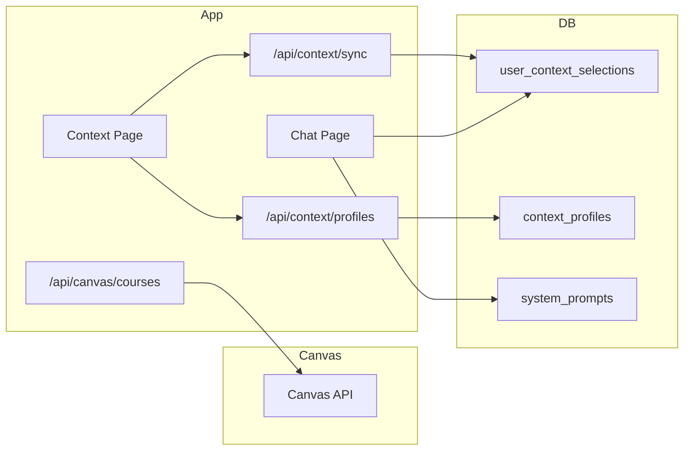

# Context Management

This page describes how Canvas context and system prompts are managed and passed to the chat.

## Context Flow

## Selected Context

- **user_context_selections:** One row per user. Stores `selected_courses`, `selected_assignments`, `selected_modules` as JSONB arrays of IDs.
- **Attach to messages:** When sending a message, the chat handler builds `contextParts` from selected context and appends them as message parts with `type: 'context'`.
- **Request body:** Frontend sends `selected_context: { courses, assignments, modules }` (or legacy `canvasContext`) in the chat request.

## Context Profiles

- **context_profiles:** Named presets. Each has `selected_courses`, `selected_assignments`, `selected_modules`.
- **Current profile:** `user_context_selections.current_profile_id` points to the active profile. Loading a profile updates the selection.

## System Prompts

- **system_prompts:** Templates (`is_template: true`) are shared; user-created prompts are scoped by `user_id`.
- **Selection:** `user_context_selections.current_system_prompt_id` or `enabled_system_prompt_ids`; chat request can override with `selected_system_prompt_ids`.
- **Mode sync:** When user picks a mode (e.g., rubric), the corresponding template is auto-selected.

## Canvas Data Sync

- **Sync API:** `/api/context/sync` fetches courses, assignments, modules from Canvas and returns available context.
- **Canvas API:** Requires user's token from `profiles.canvas_api_key_encrypted` (decrypted server-side).
