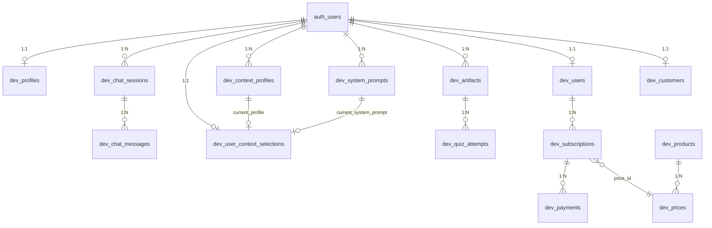

# Data Model

Lulu stores data in Supabase using the `dev` schema. This page summarizes the main tables and relationships.

## Entity Relationship (Simplified)

## Core Tables

| Table | Purpose |
|-------|---------|
| **profiles** | User profile; Canvas credentials (encrypted), institution URL |
| **chat_sessions** | Chat sessions; user_id, title, last_message_at |
| **chat_messages** | Messages per session; role (user/assistant), ui_parts (JSONB) |
| **user_context_selections** | Selected courses, assignments, modules; current profile and system prompt |
| **context_profiles** | Named presets for context selection |
| **system_prompts** | System prompts; templates (is_template) and user-created |
| **artifacts** | Saved outputs; artifact_type (quiz, rubric_analysis, note), artifact_data (JSONB) |
| **quiz_attempts** | Quiz attempts; artifact_id, user_answers, score |

## Billing Tables (Polar)

| Table | Purpose |
|-------|---------|
| **users** | Polar customer link; subscription_status, current_plan_id |
| **subscriptions** | Polar subscription sync |
| **payments** | Payment records |
| **products** | Product catalog (from Polar) |
| **prices** | Price tiers |
| **customers** | Polar customer ID mapping |
| **webhook_events** | Incoming webhook log for idempotency |

## RLS

All tables have Row Level Security (RLS) enabled. Policies scope data by `auth.uid()` so users only access their own rows.
