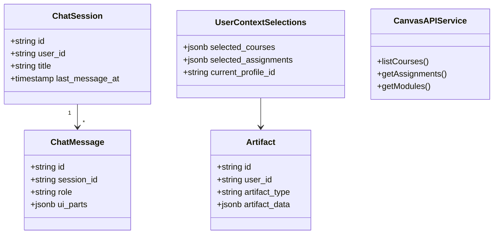

# Domain Model

This page describes the main domain objects and services in Lulu using a class diagram.

## Class Diagram

## Related

- [Data Model](/docs/system-design/data-model) — Database schema (ERD)
- [Chat Flow](/docs/system-design/chat-flow) — Request/response sequence
